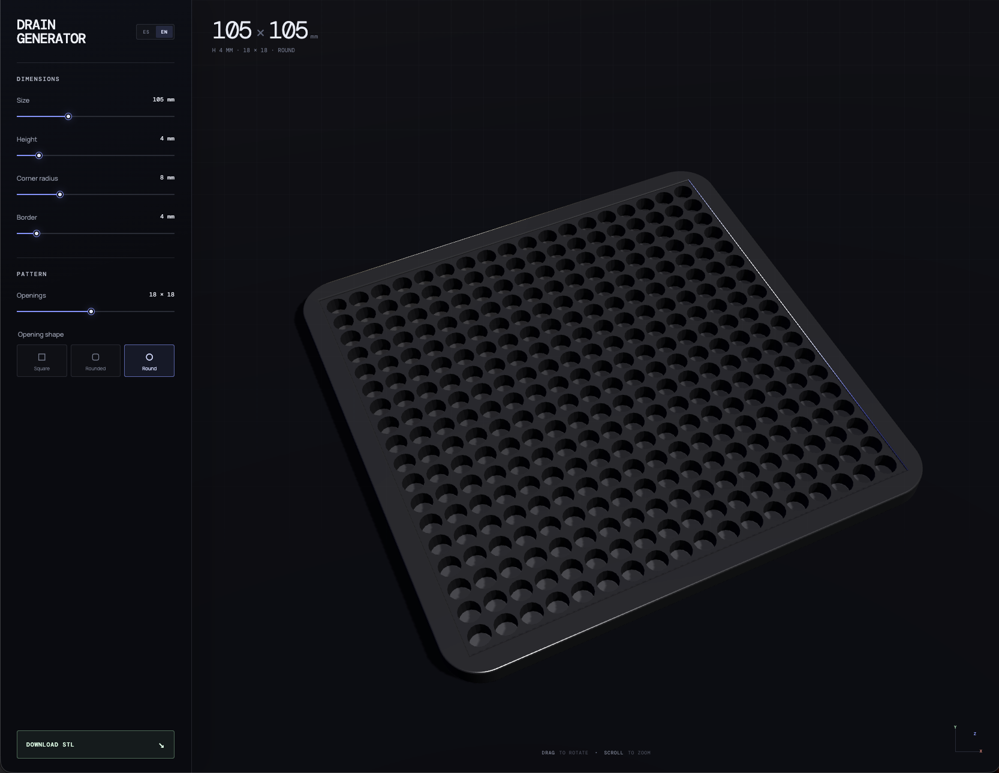

# Drain Generator

Drain Generator is a browser-based parametric drain configurator. It lets
users customize a drain cover, inspect the result in an interactive 3D preview,
and export the generated model as a binary STL file for fabrication or 3D
printing.

## Demo

[](https://manuuarizaa.github.io/drain-generator/)

The application is available at
[manuuarizaa.github.io/drain-generator](https://manuuarizaa.github.io/drain-generator/).

## Features

- Real-time WebGL preview powered by Three.js.
- Adjustable size, height, corner radius, border, and opening count.
- Square, rounded, and circular opening patterns.
- Mouse and touch controls for rotating and zooming the model.
- Binary STL generation and download directly in the browser.
- Spanish and English interfaces with automatic browser-language detection.
- Persisted language preference.
- Responsive layout for desktop and mobile devices.

## Technology

- React
- TypeScript
- Vite
- Three.js
- Earcut
- Vitest
- pnpm

## Getting Started

### Requirements

- Node.js 20.19 or later, or Node.js 22.13 or later
- pnpm 10 or later

### Installation

```bash
pnpm install
```

### Development

Start the local development server:

```bash
pnpm dev
```

### Production Build

```bash
pnpm build
```

Preview the production build locally:

```bash
pnpm preview
```

## Validation

Run the complete local quality gate:

```bash
pnpm validate
```

This executes type checking, ESLint, Prettier verification, tests with coverage,
React Doctor, and the production build. The individual commands are also
available:

```bash
pnpm typecheck
pnpm lint
pnpm format:check
pnpm test
pnpm test:coverage
pnpm react:doctor
pnpm build
```

## How It Works

The control panel updates a normalized drain configuration. Pure domain
functions derive the physical layout and triangle mesh in millimeters. The
Three.js preview and binary STL exporter consume that same geometry so the
downloaded model matches the viewport.

The main architectural boundaries are:

- `domain`: constraints, configuration normalization, layout, contours, and
  canonical mesh generation.
- `adapters`: conversion of the canonical model to Three.js and binary STL.
- `hooks`: configurator state, export lifecycle, scene lifecycle, animation,
  and interactions.
- `components`: presentation and accessible controls.
- `shared`: browser-specific utilities such as safe storage and file download.

The Three.js viewport is loaded as a separate lazy chunk. STL generation is
loaded only when requested and runs in a Web Worker outside the main UI thread.
The WebGL renderer pauses when the page or viewport is not visible and respects
the user's reduced-motion preference. Vite's chunk warning budget is explicitly
set to 750 kB for the isolated Three.js chunk; the initial application chunk is
kept substantially smaller.

## Quality Policy

- Domain and adapter coverage is enforced by Vitest.
- ESLint includes the React Hooks rules and type-aware TypeScript checks.
- React Doctor is installed as a pinned development dependency and runs without
  telemetry in CI.
- Pull requests should keep `pnpm validate` passing.
- Geometry changes must include tests for supported extremes and preserve a
  watertight, non-degenerate mesh.

## Deployment

Vite uses `/drain-generator/` as its public base because the application is
deployed to the GitHub Pages project path. The deployment workflow validates
the project before uploading `dist`.

Production source maps are currently generated to support debugging. If the
repository or deployment becomes private, review whether source maps should be
published or changed to hidden source maps.

## Browser Requirements

The 3D preview requires WebGL2. If WebGL is unavailable, the application keeps
the configurator usable and presents a fallback message. STL export does not
depend on the WebGL renderer.
